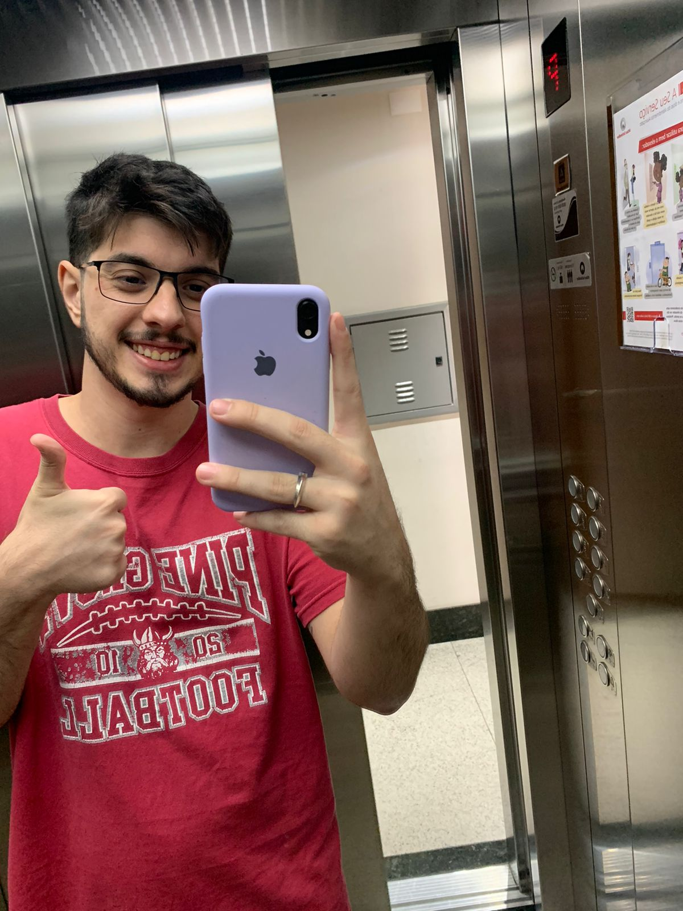

## Who am I?

👤 **Théo Lopes**

I started programming at 16 out of curiosity and soon discovered my passion for crafting solutions with code. In recent years, I've deepened my expertise and embraced the DevOps culture. My natural curiosity constantly pushes me to explore diverse technologies, even beyond my comfort zone, ensuring I stay ahead in the tech landscape.

> Whether I'm on the job or off the clock, I breathe technology.

### Core Skills
- **Python**
- **Django**
- **Javascript**

### Areas of Exploration (or "Professional Development")
- **C#**
- **Kubernetes**
- **Docker**
- **Jenkins**

 **My mission:**
- Create high-quality software.
- Optimize processes.
- Deliver agile and efficient solutions.

