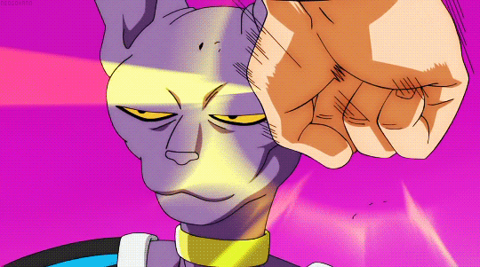

 

 
 

<h1 style="color: #e1e4e8; font-weight: 700; margin-bottom: 5px;">
ReformedTheo 💤
</h1>

<h3 style="color: #8b949e; font-weight: 400;">
Full Stack // 
DevOps // 
Unreal Engine
</h3>

 

 
 

 
 

 
 

 
 
 

 

  

